# WORKFLOW TOÀN BỘ DỰ ÁN — Kizuna Nihongo (Sorakara)

> Tài liệu tổng hợp toàn bộ luồng **nghiệp vụ** và **kỹ thuật** của hệ thống học tiếng Nhật
> Kizuna Nihongo. Mọi số liệu, đường dẫn file, endpoint và tên bảng trong tài liệu này được
> khảo sát trực tiếp từ source code và database thật.

---

## MỤC LỤC

1. [Tổng quan & Kiến trúc](#1-tổng-quan--kiến-trúc)
2. [Vai trò & Phân quyền](#2-vai-trò--phân-quyền)
3. [Luồng nghiệp vụ — Student](#3-luồng-nghiệp-vụ--student)
4. [Luồng nghiệp vụ — Teacher](#4-luồng-nghiệp-vụ--teacher)
5. [Luồng nghiệp vụ — Admin](#5-luồng-nghiệp-vụ--admin)
6. [Luồng kỹ thuật chuyên sâu](#6-luồng-kỹ-thuật-chuyên-sâu)
7. [Database](#7-database)
8. [Dev workflow](#8-dev-workflow)
9. [Phụ lục](#9-phụ-lục)

---

## 1. TỔNG QUAN & KIẾN TRÚC

**Kizuna Nihongo** là nền tảng web học tiếng Nhật theo lộ trình JLPT N5–N1, gồm 3 vai trò
(Student / Teacher / Admin) với các nhóm tính năng: khoá học, tự học (từ vựng/kanji/ngữ pháp/
flashcard/từ điển), luyện 4 kỹ năng (nghe/đọc/viết/phát âm), thi thử JLPT, gói Premium &
thanh toán, và trợ lý AI.

### 1.1. Sơ đồ kiến trúc

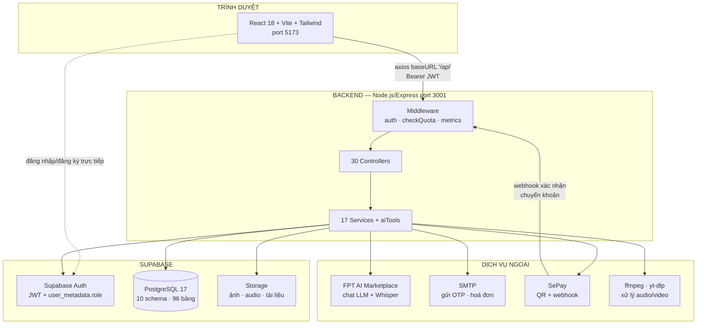

### 1.2. Công nghệ

| Lớp | Công nghệ |
|---|---|
| Frontend | React 18, Vite, React Router, Tailwind CSS, axios |
| Backend | Node.js 22, Express, multer (upload), node-cron (tác vụ định kỳ) |
| Database & Auth | Supabase (PostgreSQL 17, Supabase Auth, Storage) |
| AI | FPT AI Marketplace — LLM (chat/QA) + Whisper (speech-to-text) |
| Tiếng Nhật | kuroshiro + kuromoji (furigana), wanakana (kana) |
| Media | ffmpeg (audio), yt-dlp (YouTube), node-vad (phát hiện khoảng lặng), msedge-tts (TTS) |
| Thanh toán | SePay (QR chuyển khoản + webhook) |
| Email | nodemailer (SMTP) |

### 1.3. Quy mô hệ thống

| Thành phần | Số lượng |
|---|---|
| API endpoints | **389** |
| Nhóm route (`backend/routes/api/`) | 24 |
| Controllers | 30 |
| Services | 17 + `aiTools/` (registry, execute) |
| Middleware | 3 (`auth.js`, `checkQuota.js`, `metrics.js`) |
| Route frontend (`App.jsx`) | **100** |
| Page components | **90** (public 6, student 36, teacher 15, admin 31, shared 2) |
| Components khác | 65 |
| Contexts / lib | 4 / 22 |
| Schema database | **10** module + `public` |
| Bảng database | **96** (+ 52 view tương thích ở `public`) |

### 1.4. Cấu trúc thư mục

```
d:\swp
├── backend/
│   ├── app.js                 # khai báo Express: CORS, parser, metrics, mount 24 route group
│   ├── server.js              # listen port + cron chốt doanh thu
│   ├── routes/api/            # 24 file định nghĩa endpoint
│   ├── controllers/           # 30 file xử lý request
│   ├── services/              # 17 file logic nghiệp vụ + aiTools/
│   ├── middleware/            # auth, checkQuota, metrics
│   ├── config/                # supabase, ai, audio, youtube
│   ├── utils/
│   └── scripts/               # script seed dữ liệu (từ điển, kanji…)
├── frontend/
│   └── src/
│       ├── App.jsx            # 100 route + các Route guard
│       ├── pages/             # public · student · teacher · admin · shared
│       ├── components/        # 14 nhóm component
│       ├── contexts/          # Auth · Confirm · Lang · Page
│       └── lib/               # api (axios), supabase, i18n, hooks…
├── database/schema.sql        # NGUỒN CHUẨN của schema (xuất từ DB thật)
├── docs/
└── .env                       # biến môi trường backend (ở GỐC repo)
```

---

## 2. VAI TRÒ & PHÂN QUYỀN

### 2.1. Ba vai trò

Vai trò được lưu trong **Supabase Auth** tại `user_metadata.role`, không phải bảng riêng.

| Role | Trang chủ sau đăng nhập | Phạm vi |
|---|---|---|
| `student` | `/dashboard` | Học, luyện tập, thi thử, mua gói/khoá học |
| `teacher` | `/teacher` | Soạn nội dung, ngân hàng câu hỏi riêng, xem thu nhập |
| `admin` | `/admin` | Toàn quyền quản trị hệ thống |

> ⚠️ **Lưu ý quan trọng**: Supabase Admin API `updateUserById` **ghi đè toàn bộ** `user_metadata`.
> Vì vậy mọi thao tác cập nhật phải dùng helper `updateUserMetadata()` trong
> [backend/config/supabase.js](../backend/config/supabase.js) để **merge** metadata cũ với dữ liệu mới,
> nếu không sẽ mất `full_name`, `avatar_url`…

### 2.2. Phân quyền phía Backend

File: [backend/middleware/auth.js](../backend/middleware/auth.js)

| Middleware | Hành vi |
|---|---|
| `requireAuth` | Lấy `Bearer` token → `supabaseAdmin.auth.getUser(token)` → gắn `req.user`. Thiếu/sai token → **401** |
| `requireAdmin` | Chỉ cho `role === 'admin'`, sai → **403** |
| `requireTeacher` | Cho `role === 'teacher'` **hoặc** `'admin'`, sai → **403** |
| `optionalAuth` | **Không chặn**: có token hợp lệ thì gắn `req.user`, không có thì đi tiếp như khách |

### 2.3. Phân quyền phía Frontend

Các guard trong `frontend/src/components/shared/`:

| Guard | Hành vi |
|---|---|
| `ProtectedRoute` | Chưa đăng nhập → `/login`. Mọi role đăng nhập đều vào được |
| `AdminRoute` | Không phải admin → `/dashboard` |
| `TeacherRoute` | Không phải teacher/admin → `/dashboard` |
| `StudentRoute` | Chỉ student. Admin → `/admin`, teacher → `/teacher` |

`StudentRoute` có 4 prop điều chỉnh hành vi:

| Prop | Ý nghĩa |
|---|---|
| `allowAdmin` | Cho admin vào xem như học viên thật (vd `/courses`) |
| `allowTeacher` | Cho teacher vào (vd thi thử JLPT) |
| `adminRedirectTo` | Chuyển admin sang trang preview riêng, hỗ trợ `:param` (vd `/admin/courses/preview/:id`) |
| `teacherRedirectTo` | Tương tự cho teacher |

### 2.4. Mô hình bảo mật — điểm cần biết

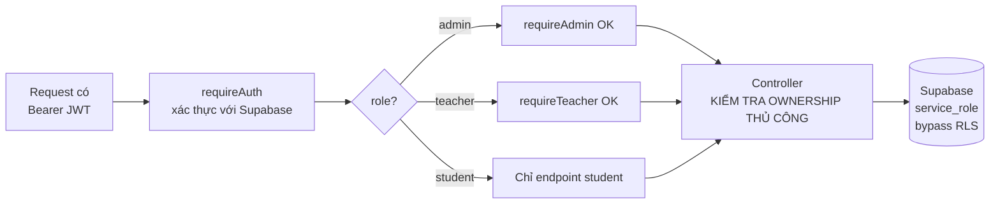

> 🔒 **Database KHÔNG bật RLS (Row Level Security).** Backend luôn dùng `service_role` key nên bypass
> mọi ràng buộc ở tầng DB. Hệ quả:
> - Mọi kiểm tra quyền sở hữu (`created_by`, `student_id`, `teacher_id`…) **phải viết tay trong
>   controller**. Bỏ sót một chỗ là lỗ hổng IDOR (xem được dữ liệu người khác).
> - Mọi endpoint mutating nên `SELECT` trước theo `id AND owner` rồi mới ghi.
> - `SUPABASE_SERVICE_ROLE_KEY` bị lộ = toàn bộ dữ liệu bị lộ.

---

## 3. LUỒNG NGHIỆP VỤ — STUDENT

### 3.1. Đăng ký + xác thực OTP

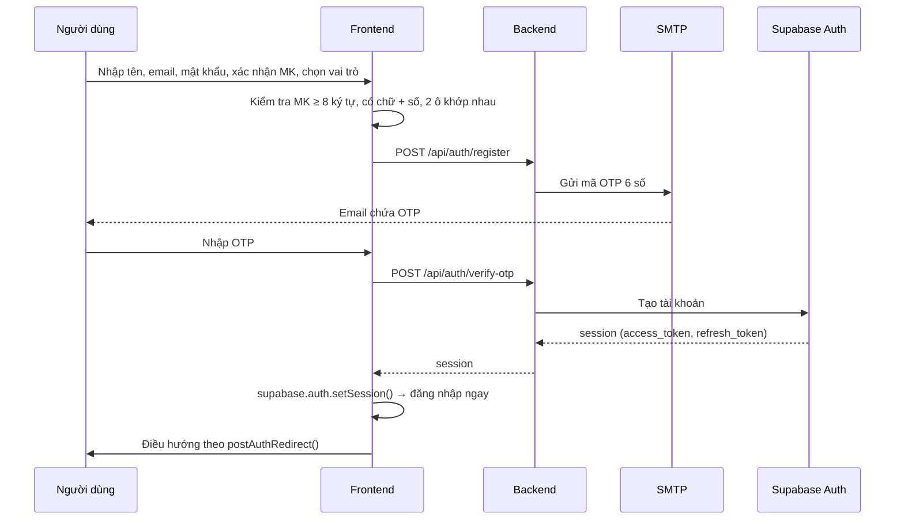

- **Endpoint**: `POST /api/auth/register`, `POST /api/auth/verify-otp`, `POST /api/auth/resend-otp`
- **Điều hướng sau đăng nhập**: [frontend/src/lib/authRedirect.js](../frontend/src/lib/authRedirect.js)
  → `postAuthRedirect()`: admin → `/admin`, teacher → `/teacher`, có cờ ý định giáo viên →
  `/teacher-application`, còn lại → `/dashboard`.

### 3.2. Đăng nhập (email hoặc Google)

- **Email/mật khẩu**: `supabase.auth.signInWithPassword()` gọi trực tiếp từ frontend.
- **Google OAuth**: `signInWithOAuth({ provider: 'google', redirectTo: ${origin}/login })`.
- **Vấn đề đã xử lý**: vòng OAuth rời khỏi trang nên mọi state React bị mất. Ý định "đăng ký làm giáo
  viên" được giữ bằng cờ `pendingTeacherSignup` trong `sessionStorage` (`setTeacherIntent()`), đọc lại
  ở `postAuthRedirect()` khi quay về. Cờ được xoá khi tiêu thụ và khi logout.
- **Token**: axios interceptor trong [frontend/src/lib/api.js](../frontend/src/lib/api.js) tự gắn
  `Authorization: Bearer <token>` cho mọi request; khi gặp **401** sẽ thử `refreshSession()` một lần,
  thất bại thì đăng xuất và chuyển `/login?expired=1`.

### 3.3. Quên / đặt lại mật khẩu
`POST /api/auth/forgot-password` (gửi OTP) → `POST /api/auth/reset-password-otp` (xác nhận OTP + mật
khẩu mới).

### 3.4. Khoá học: xem, ghi danh, mua

| Bước | Endpoint |
|---|---|
| Danh sách khoá học (có filter, tab "Khoá học của tôi" qua `?enrolled=true`) | `GET /api/courses` |
| Chi tiết khoá học | `GET /api/courses/:id` |
| Ghi danh khoá miễn phí | `POST /api/courses/:id/enroll` |
| Kiểm tra trạng thái ghi danh | `GET /api/courses/:id/enrollment-status` |
| Huỷ ghi danh | `DELETE /api/courses/:id/unenroll` |
| Mua khoá học có phí | `POST /api/courses/:id/checkout` |
| Theo dõi / huỷ đơn | `GET`/`POST /api/courses/payment-orders/:orderId[/cancel]` |
| Khoá đã mua | `GET /api/courses/my-purchases` |
| Đánh giá khoá học | `GET/POST/PUT/DELETE /api/courses/:id/reviews[/:reviewId]` |

> **Gating nội dung**: [backend/services/courseAccess.js](../backend/services/courseAccess.js) →
> `checkCourseContentAccess(courseId, user)` trả về quyền dựa trên `is_free`, `price`, đã ghi danh,
> đã mua. **Bắt buộc ghi danh mới xem được nội dung — kể cả khoá miễn phí.** Frontend khoá các dòng
> bài học đến khi ghi danh.

### 3.5. Học bài & quiz

- Xem bài học: `GET /api/lessons/:id` — bài gồm video (kèm transcript đồng bộ), nội dung đọc, từ vựng,
  kanji, ngữ pháp.
- Bài đọc trong bài học: `GET /api/lessons/reading/:id`, hỏi AI về bài đọc:
  `POST /api/lessons/reading/:id/chat`.
- Hoàn thành bài: `POST /api/lessons/:id/complete` → cập nhật `course_module.lesson_progress`
  (service `lessonProgress.js`).
- Quiz: `GET /api/quizzes/:id` → `POST /api/quizzes/:id/attempt` → `GET /api/quizzes/:id/results`;
  lịch sử `GET /api/quizzes/history`.
- **Chống gian lận quiz**: `POST /api/quizzes/:id/fullscreen-violation` (đếm vi phạm thoát toàn màn
  hình) và `POST /api/quizzes/:id/proctor-snapshot` (ảnh giám sát). Frontend dùng hook
  `useFullscreenLockdown`, `useProctoring`, `faceDetector`. Vi phạm nhiều lần → ghi vào
  `exam_module.quiz_lockouts`.
- **Điểm đạt**: service `passThreshold.js` quyết định đạt/không theo `passing_type` + `passing_value`.

### 3.6. Từ điển
`GET /api/dictionary/search` (tìm theo kanji/kana/romaji hoặc nghĩa tiếng Việt) và
`GET /api/dictionary/:id`. Tra nghĩa tiếng Việt dùng hàm `dictionary_module.search_dict_by_meaning`
(khớp nguyên từ, ưu tiên đúng dấu, xếp hạng kết quả).

### 3.7. Flashcard (19 endpoint)

| Nhóm | Endpoint |
|---|---|
| Học phần | `GET/POST /api/flashcards/sets`, `GET/PUT/DELETE /api/flashcards/sets/:id` |
| Thẻ | `POST /api/flashcards/sets/:id/cards` |
| Tiến độ | `GET/PUT/DELETE /api/flashcards/sets/:id/progress[/:cardId]` |
| Bài kiểm tra AI | `GET /api/flashcards/sets/:id/test`, `POST /api/flashcards/sets/:id/test/generate` |
| Thư mục | `GET/POST /api/flashcards/folders`, `GET/PUT/DELETE /api/flashcards/folders/:id` |
| Gán học phần vào thư mục | `POST/DELETE /api/flashcards/folders/:id/sets[/:setId]` |

- Tiến độ theo mô hình **thuộc / chưa thuộc** (`flashcard_progress.status`: `learning` | `mastered`),
  không dùng SM-2.
- Bài kiểm tra do LLM sinh (`flashcardTestGen.js`), mỗi học phần lưu tối đa 1 bài
  (`flashcard_tests.set_id` UNIQUE, tạo lại = ghi đè). **Quota**: `flashcard_test_gen_daily`.
- Gợi ý định nghĩa bằng AI: `POST /api/ai/flashcard-define` — **quota** `flashcard_ai_suggest_daily`.

### 3.8. Study list (danh sách học)
`GET/POST/PUT/DELETE /api/study-lists[/:id]`, thêm/xoá mục `POST /api/study-lists/:id/items`,
`DELETE .../items/:itemId`. Nhập liệu hàng loạt từ file: `POST /api/study-lists/:id/vocabulary/import-file`
(và bản `kanji`, `grammar-points`), hoặc `POST /api/study-lists/:id/import`.

### 3.9. Luyện viết kanji
`GET /api/kanji`, `GET /api/kanji/:id`, chấm nét viết `POST /api/kanji/score-writing`. Xuất bảng tập
viết PDF: `frontend/src/lib/kanjiWorksheet.js` (**quota** `kanji_file_monthly`).

### 3.10. Luyện nghe (12 endpoint) — luồng phức tạp nhất

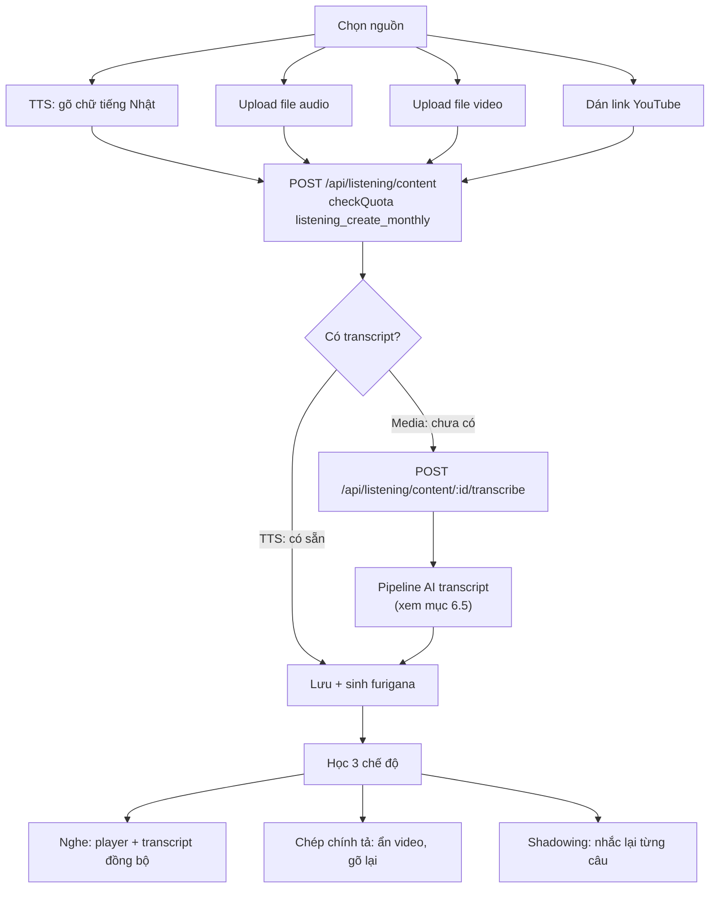

| Chức năng | Endpoint |
|---|---|
| Bài nghe hệ thống | `GET /api/listening`, `GET /api/listening/:id` |
| Nội dung tự tạo của tôi | `GET /api/listening/content/mine` |
| Tạo nội dung | `POST /api/listening/content` |
| Xem / sửa / xoá | `GET/PUT/DELETE /api/listening/content/:id` |
| Sinh transcript AI | `POST /api/listening/content/:id/transcribe` |
| Chấm phát âm | `POST /api/listening/score-pronunciation` |
| Audio người dùng (cũ) | `GET/POST/DELETE /api/listening/user-audio[/:id]` |

- **Quota**: `listening_create_monthly` (Free 2 lượt/tháng, Premium không giới hạn),
  `listening_practice_monthly`.
- Nội dung học viên tạo là **riêng tư** (`is_public = false`); admin tạo thì công khai. Quyết định này
  do **backend** đảm nhiệm theo vai trò, không tin frontend.
- Component dùng chung `ListeningContentManager.jsx` cho cả admin và học viên; `SegmentPlayer.jsx`
  phát theo từng câu, hoạt động cho cả thẻ `<audio>` và **YouTube IFrame API**.

### 3.11. Luyện đọc
`GET /api/reading` (danh sách theo cấp độ), `GET /api/reading/:id`, hỏi AI về bài:
`POST /api/reading/:id/chat`. Bài đọc lưu sẵn furigana + bản dịch từng câu trong `articles.segments`,
kèm `questions` / `vocab` / `grammar` sinh trước lúc tạo bài → học viên đọc không tốn chi phí AI.
Lượt đọc ghi vào `practice_module.article_reads` (dedupe theo `(article_id, user_id)`).
**Quota**: `reading_daily` (Free 2 bài mới/ngày).

### 3.12. Luyện viết
`POST /api/writing/submit` → AI chấm (điểm tổng, ngữ pháp, từ vựng, mạch lạc, bản sửa) →
`GET /api/writing/history`, `GET /api/writing/:id`. Giáo viên có thể chấm lại thủ công
(`teacher_score`, `teacher_feedback`).

### 3.13. Thi thử JLPT

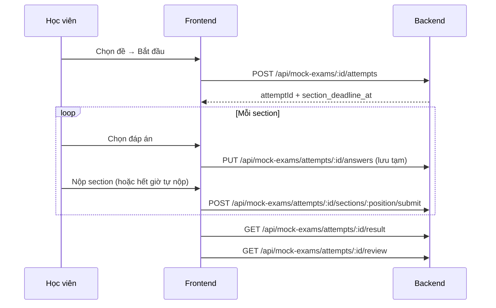

| Chức năng | Endpoint |
|---|---|
| Danh sách đề / chi tiết | `GET /api/mock-exams`, `GET /api/mock-exams/:id` |
| Bắt đầu làm | `POST /api/mock-exams/:id/attempts` |
| Trạng thái hiện tại | `GET /api/mock-exams/attempts/:attemptId/current` |
| Lưu đáp án | `PUT /api/mock-exams/attempts/:attemptId/answers` |
| Nộp từng phần | `POST /api/mock-exams/attempts/:attemptId/sections/:position/submit` |
| Kết quả / xem lại | `GET .../result`, `GET .../review` |
| Lịch sử / bảng xếp hạng | `GET /api/mock-exams/me/history`, `GET /api/mock-exams/:id/leaderboard` |

- Mỗi section có thời gian riêng (`time_limit_minutes`), hết giờ **tự nộp**.
- Teacher cũng được vào thi (route dùng `allowTeacher`), phân biệt qua `mock_attempts.user_role`.
- **Trợ lý AI bị chặn khi đang thi** — xem mục 6.6.

### 3.14. Lộ trình học AI
`GET /api/learning-path`, sinh mới `POST /api/learning-path/generate`, tạo lại
`POST /api/learning-path/regenerate`, cập nhật trạng thái bước `PATCH /api/learning-path/steps/:id`.
**Quota**: `learning_path_generate_monthly`.

### 3.15. Nâng cấp Premium & thanh toán

| Bước | Endpoint |
|---|---|
| Xem các gói | `GET /api/subscription/plans` |
| Gói hiện tại của tôi | `GET /api/subscription/me` |
| Tạo đơn thanh toán | `POST /api/subscription/checkout` |
| Theo dõi / huỷ đơn | `GET /api/subscription/payment-order/:id`, `POST .../cancel` |
| Lịch sử thanh toán | `GET /api/subscription/billing` |
| Hạn mức đã dùng | `GET /api/subscription/usage` |
| Ảnh QR | `GET /api/paymentQr/qr` |

Chi tiết luồng tiền: mục 6.4.

### 3.16. Trợ lý AI
`POST /api/ai/chat` (**quota** `ai_chat_daily`), quản lý hội thoại
`GET /api/ai/sessions`, `GET/DELETE /api/ai/sessions/:id`, xác nhận hành động
`POST /api/ai/action/confirm`, sinh furigana `POST /api/ai/furigana`, kiểm tra kết nối
`GET /api/ai/ping`. Trợ lý biết ngữ cảnh trang hiện tại qua `PageContext`.

---

## 4. LUỒNG NGHIỆP VỤ — TEACHER

### 4.1. Trở thành giáo viên

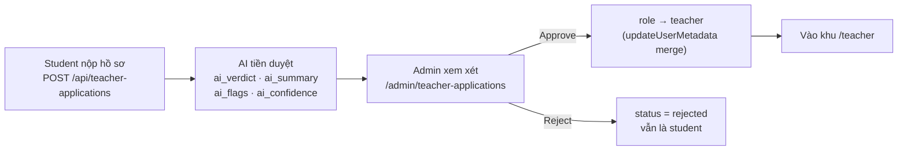

- Nộp/xem hồ sơ: `POST /api/teacher-applications`, `GET /api/teacher-applications/me`.
- Hồ sơ gồm: điện thoại, trình độ cao nhất, chuyên môn, số năm kinh nghiệm, học vấn, giới thiệu,
  tài liệu đính kèm (`documents` jsonb). Bảng `users_module.teacher_applications`.
- AI chấm trước để admin quyết nhanh; quyết định cuối vẫn do admin.

### 4.2. Khu làm việc của giáo viên (97 endpoint `/api/teacher/*`)

| Nhóm | Trang frontend |
|---|---|
| Dashboard | `/teacher` |
| Thu nhập (revenue pool) | `/teacher/earnings` |
| Khoá học của tôi | `/teacher/courses`, soạn nội dung `/teacher/courses/:courseId/edit` |
| Soạn theo Unit | `/teacher/courses/:courseId/units/:unitId/edit` |
| Soạn từng phần bài học | `/teacher/lessons/:lessonId/{video,reading,vocabulary,kanji,quiz,grammar}` |
| Xem trước như học viên | `/teacher/courses/preview/:id`, `/teacher/lessons/preview/:id`, `/teacher/quizzes/preview/:id` |
| Kho từ vựng / kanji / ngữ pháp | `/teacher/vocab`, `/teacher/kanji`, `/teacher/grammar` |
| Ngân hàng câu hỏi riêng | `/teacher/question-bank` |
| Study list | `/teacher/study-lists` |
| Luyện nghe | `/teacher/listening` |
| Từ điển | `/teacher/dictionary` |

- Nội dung giáo viên đóng góp vào kho chung (`language_module.teacher_vocabulary`,
  `teacher_kanji`) có trạng thái `draft` → chờ admin duyệt, kèm `admin_note`.
- Ngân hàng câu hỏi riêng: `exam_module.teacher_question_bank`, `teacher_reading_passages` — có
  `source_bank_id` để truy vết câu copy từ bank hệ thống.

### 4.3. Thu nhập giáo viên
Mỗi lần học viên dùng nội dung của giáo viên → ghi 1 dòng `billing_module.content_usage_events`.
Cuối tháng hệ thống chốt quỹ và chia (mục 6.7).

---

## 5. LUỒNG NGHIỆP VỤ — ADMIN

158 endpoint `/api/admin/*` và 31 trang quản trị.

| Nhóm | Trang | Ghi chú |
|---|---|---|
| Dashboard | `/admin` | Thống kê tổng quan |
| Trạng thái hệ thống | `/admin/system` | Số liệu từ middleware `metrics.js` |
| **Người dùng** | `/admin/users` | Tìm kiếm, đổi vai trò, đặt lại mật khẩu, xoá |
| Hồ sơ giáo viên | `/admin/teacher-applications` | Xem kết quả AI + duyệt/từ chối |
| Khoá học | `/admin/courses`, `/admin/courses/:courseId/edit` | CRUD khoá, unit, bài học |
| Nội dung bài học | `/admin/lessons/:lessonId/{video,reading,vocabulary,kanji,quiz,grammar}` | |
| Từ vựng / Kanji / Ngữ pháp | `/admin/vocabulary`, `/admin/kanji`, `/admin/grammar-points` | Duyệt cả đóng góp của giáo viên |
| Study list | `/admin/study-lists` | |
| Ngân hàng câu hỏi | `/admin/questions` | |
| Ngân hàng JLPT | `/admin/jlpt-bank` | Theo `mondai_type` + `score_category` |
| Đề thi thử | `/admin/mock-exams`, `/admin/mock-exams/:id` | Trình soạn đề |
| Luyện đọc / nghe | `/admin/reading`, `/admin/listening` | |
| Gói & thanh toán | `/admin/subscriptions`, `/admin/payments` | Cấp Premium tay, đối soát |
| Quỹ doanh thu | `/admin/revenue-pool` | Chốt kỳ, xem chia tiền |

### Guard bảo vệ trong quản lý người dùng
- Chặn admin **tự xoá** hoặc **tự hạ quyền** chính mình (tránh mất admin cuối cùng).
- Whitelist vai trò hợp lệ (`student`/`teacher`/`admin`).
- Mật khẩu đặt lại phải ≥ 8 ký tự, gồm cả chữ và số.
- Chuẩn hoá `limit`/`page` để chống truy vấn quá lớn.
- Mọi thao tác ghi vào `users_module.user_audit_logs`.
- Cấp Premium tay: `POST /api/subscription/admin/grant`, huỷ:
  `DELETE /api/subscription/admin/subscriptions/:userId/cancel`.

---

## 6. LUỒNG KỸ THUẬT CHUYÊN SÂU

### 6.1. Vòng đời một request

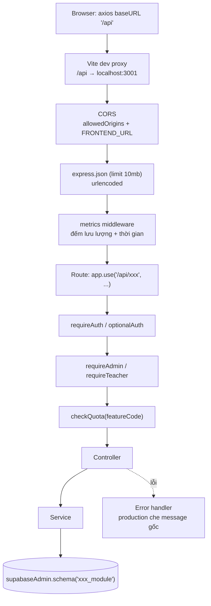

- CORS: cho phép `localhost:5173`, `localhost:3000`, `FRONTEND_URL`; ở môi trường non-production chấp
  nhận mọi `localhost:<port>` (vì Vite có thể đổi port).
- Health check: `GET /api/health` → `{"status":"ok"}`. Route không khớp → 404 JSON.

### 6.2. Xác thực & phiên đăng nhập
- Frontend giữ session bằng `supabase.auth`; `AuthContext` lắng nghe `onAuthStateChange`.
- `refreshUser()` dùng `refreshSession()` để lấy JWT mới mang metadata đã cập nhật (chỉ `getUser()`
  sẽ để lại session cũ trong storage).
- Backend không tự phát hành token — luôn xác thực token với Supabase qua `getUser(token)`.

### 6.3. Hạn mức tính năng (Quota)

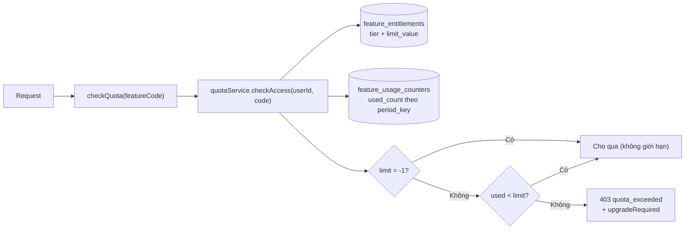

Danh sách 9 feature code:

| Feature code | Chu kỳ | Ý nghĩa |
|---|---|---|
| `ai_chat_daily` | ngày | Số lượt chat với trợ lý AI |
| `reading_daily` | ngày | Số bài luyện đọc mới |
| `flashcard_ai_suggest_daily` | ngày | Lượt AI gợi ý định nghĩa thẻ |
| `flashcard_test_gen_daily` | ngày | Lượt tạo bài kiểm tra flashcard |
| `listening_create_monthly` | tháng | Lượt tạo nội dung nghe (Free = 2) |
| `listening_practice_monthly` | tháng | Lượt luyện nghe |
| `learning_path_generate_monthly` | tháng | Lượt sinh lộ trình học |
| `kanji_file_monthly` | tháng | Lượt xuất file tập viết kanji |
| `premium_monthly` | tháng | Gói Premium |

> ⚠️ **Rủi ro đã biết**: `checkQuota` **fail-open** — nếu quota service lỗi thì cho request đi qua
> (xem [backend/middleware/checkQuota.js](../backend/middleware/checkQuota.js)). Chủ ý để lỗi hạ tầng
> không khoá người dùng, nhưng đánh đổi là khi service hỏng thì hạn mức không được thực thi.

### 6.4. Thanh toán (SePay)

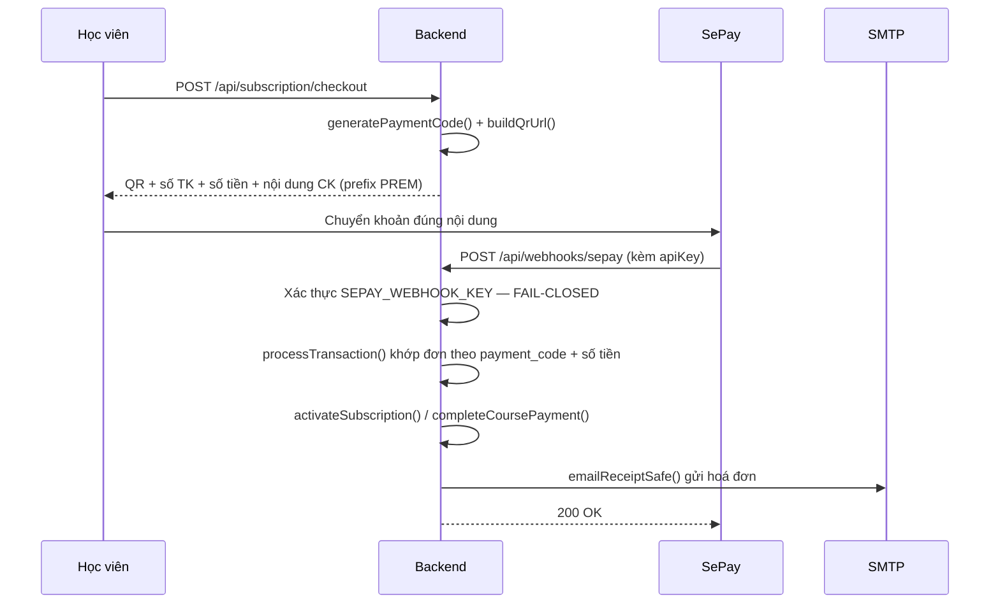

| Thành phần | File |
|---|---|
| Tạo đơn, sinh mã, dựng URL QR, hết hạn đơn | `paymentOrderService.js` (`createOrder`, `generatePaymentCode`, `buildQrUrl`, `expireOldOrders`, `cancelOrder`, `getUserPendingOrder`) |
| Khớp giao dịch, đối soát | `paymentMatchingService.js` (`processTransaction`, `matchCourseOrder`, `reconcilePendingOrders`, `emailReceiptSafe`) |
| Mua khoá học | `coursePaymentService.js` (`createCourseOrder`, `completeCoursePayment`, `listMyCoursePurchases`) |
| Gói đăng ký | `subscriptionService.js` (`activateSubscription`, `cancelSubscription`, `adminGrantPremium`, `adminListSubscriptions`) |
| Gọi API SePay | `sepayClient.js` |

- Nội dung chuyển khoản có tiền tố: `TRANSFER_CONTENT_PREFIX` (mặc định `PREM`) cho gói Premium,
  `COURSE_TRANSFER_CONTENT_PREFIX` (mặc định `COURSE`) cho khoá học.
- Đơn hết hạn theo `PAYMENT_ORDER_EXPIRE_MINUTES`; Premium kéo dài `SUBSCRIPTION_DURATION_DAYS`.
- **Đối soát thủ công**: `POST /api/webhooks/reconcile` (chỉ admin) chạy `reconcilePendingOrders()`
  cho trường hợp webhook bị miss.

> 🔒 **Bảo mật webhook (fail-closed)**: nếu `SEPAY_WEBHOOK_KEY` chưa cấu hình → trả **500** và từ
> chối; nếu chữ ký gửi lên không khớp → **401**. Tuyệt đối không xử lý webhook không xác thực, vì
> ai cũng có thể tự gọi endpoint để nâng cấp Premium miễn phí.

### 6.5. Pipeline sinh transcript AI (luyện nghe)

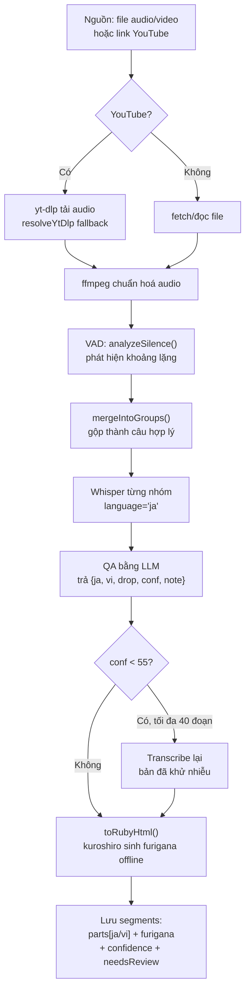

**Vì sao phải dùng VAD?** FPT Whisper **chỉ trả về `{text, usage}`** — không có timestamp/segment ở
bất kỳ định dạng nào (kể cả SRT hay `verbose_json`). Do đó **khoảng lặng (VAD) là nguồn timestamp duy
nhất**. Đây là phát hiện qua thực nghiệm, không phải lỗi tham số.

| Thành phần | File |
|---|---|
| Toàn bộ pipeline | [backend/services/lessonTranscribe.js](../backend/services/lessonTranscribe.js) — `runAudioTranscription()`, `japaneseQaSegments()` |
| VAD + ffmpeg | [backend/config/audio.js](../backend/config/audio.js) — `analyzeSilence()`, `mergeIntoGroups()` |
| Tải YouTube | [backend/config/youtube.js](../backend/config/youtube.js) — `resolveYtDlp()` thử `yt-dlp` → `python -m yt_dlp` → `python3 -m yt_dlp` → `py -m yt_dlp` |
| Whisper + LLM | [backend/config/ai.js](../backend/config/ai.js) — `whisperTranscribe()`, `chatCompletion()` |
| Furigana | [backend/services/furiganaService.js](../backend/services/furiganaService.js) — `toRubyHtml()` |

Quy tắc QA: **chỉ dùng kana/kanji** (không romaji), **loại bỏ tiếng động/sound effect** (cờ `drop`),
chấm **độ tự tin** `conf`, ghi `note` cho đoạn cần người xem lại, kèm **bản dịch tiếng Việt**.

> 💡 Furigana được **sinh trước và lưu vào DB** bằng kuroshiro (chạy cục bộ, không tốn chi phí AI),
> nên khi học viên bật furigana thì hiện **tức thì**, không phải chờ xử lý.

### 6.6. Trợ lý AI & chống gian lận

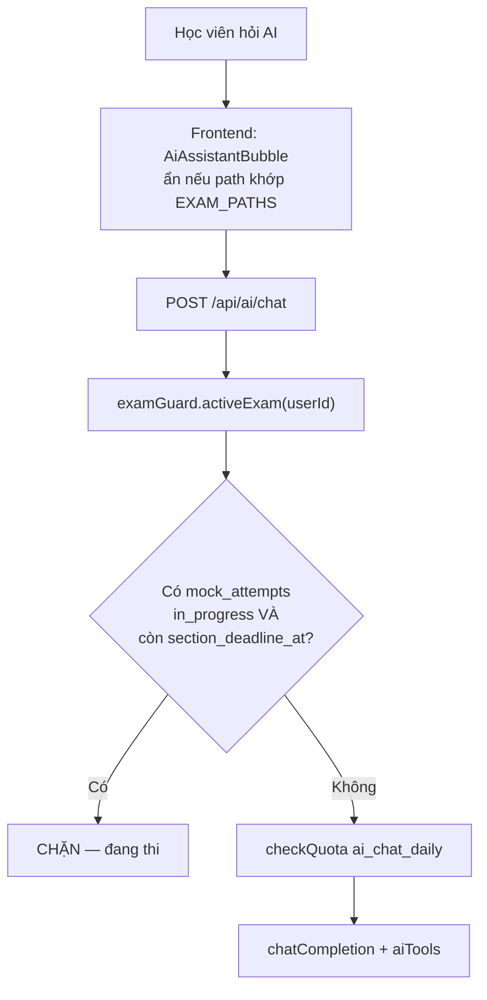

- Ẩn ở frontend **không đủ** (mở tab khác vào `/chat` là hỏi được) nên phải chặn ở server bằng
  [backend/services/examGuard.js](../backend/services/examGuard.js).
- Chỉ tính attempt **còn hạn**: attempt bỏ dở giữ `status = 'in_progress'` vĩnh viễn, nếu không lọc
  theo `section_deadline_at` thì người dùng bị khoá AI mãi mãi.
- `supabase-js` không throw khi query lỗi → code **tự ném lỗi** để không fail-open thầm lặng.
- **Giới hạn đã biết**: chỉ phủ được thi thử (`jlpt_module.mock_attempts` có bản ghi ngay khi *bắt
  đầu*). **Quiz/bài tập không chặn được** vì `exam_module.quiz_attempts` chỉ ghi khi *nộp bài*, server
  không biết học viên đang làm.
- Trợ lý dùng cơ chế **tool-calling** tự triển khai: `aiTools/registry.js` khai báo công cụ,
  `aiTools/execute.js` thực thi; hành động có tác động phải qua `POST /api/ai/action/confirm`.
  Ngữ cảnh trang lấy từ `PageContext` (các trang gọi `usePageContext`).

### 6.7. Quỹ chia sẻ doanh thu cho giáo viên

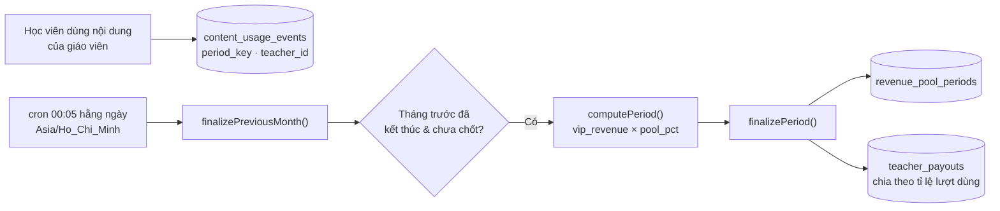

- Cron khai báo trong [backend/server.js](../backend/server.js): `cron.schedule('5 0 * * *', ...)`.
- **Idempotent**: chạy lại nhiều lần không chia tiền hai lần.
- Hàm RPC hỗ trợ: `public.vip_revenue(p_start, p_end)` (tổng doanh thu Premium đã trả),
  `public.teacher_uses(p_period)` (đếm lượt dùng theo giáo viên).
- Tỉ lệ quỹ (`pool_pct`) lưu trong `public.app_settings` (đọc qua `settingsService.js`).

### 6.8. Các thành phần kỹ thuật khác

| Thành phần | File | Vai trò |
|---|---|---|
| Đo lưu lượng | `middleware/metrics.js` | Đếm request + thời gian phản hồi cho trang System Status |
| Cấu hình hệ thống | `services/settingsService.js` | Đọc/ghi `public.app_settings` (key/value jsonb) |
| Ngưỡng đạt | `services/passThreshold.js` | Tính đạt/không đạt cho quiz |
| Tiến độ bài học | `services/lessonProgress.js` | Cập nhật `lesson_progress`, `%` hoàn thành khoá |
| Tách từ tiếng Nhật | `services/jaTokenizer.js` | Phục vụ furigana/phân tích |
| Đa ngữ | `contexts/LangContext.jsx` + `lib/i18n.js` | Chuyển đổi VI/JA trên UI |
| Hộp thoại xác nhận | `contexts/ConfirmContext.jsx` | Thay `window.confirm/alert` bằng popup |
| Giám sát thi | `lib/useProctoring.js`, `useFullscreenLockdown.js`, `faceDetector.js` | Khoá toàn màn hình, chụp ảnh, nhận diện khuôn mặt |
| Xuất file | `lib/kanjiWorksheet.js`, `renderPreview.js`, `components/receipt/` | PDF tập viết, hoá đơn |

---

## 7. DATABASE

**Nguồn chuẩn**: [database/schema.sql](../database/schema.sql) — xuất trực tiếp từ database thật
(96 bảng, 331 ràng buộc, 24 function, 52 view, 18 trigger, 95 index, RLS + 47 policy).

### 7.1. Mười schema theo domain

| Schema | Số bảng | Nội dung |
|---|:---:|---|
| `language_module` | 17 | Kho từ vựng, kanji, ngữ pháp, các bộ sưu tập, study list, đóng góp của giáo viên, `jlpt_levels`, `topics` |
| `practice_module` | 12 | Luyện đọc (`articles`, `article_reads`), luyện nghe (`listening_dialogues`, `listening_user_audios`), bộ đề đọc (`reading_sets`, `rs_*`), luyện viết, chấm phát âm |
| `course_module` | 11 | `courses`, `units`, `lessons`, ghi danh, đánh giá, tiến độ, bảng nối bài học ↔ từ vựng/kanji/ngữ pháp, `skills` |
| `billing_module` | 11 | Gói đăng ký, đơn thanh toán, giao dịch, hạn mức (`feature_entitlements`, `feature_usage_counters`), quỹ doanh thu, chi trả giáo viên |
| `exam_module` | 9 | Quiz, câu hỏi, lượt làm, khoá do vi phạm, ngân hàng câu hỏi (hệ thống + giáo viên), đoạn đọc/nghe |
| `ai_module` | 9 | Chat AI, lộ trình học, thông báo, dashboard học viên, câu hỏi do AI sinh, bảng tập viết kanji |
| `jlpt_module` | 8 | Đề thi thử (`mock_exams`, `mock_exam_sections`, `mock_question_groups`, `mock_questions`), lượt thi, ngân hàng JLPT |
| `users_module` | 6 | `users`, `roles`, hồ sơ học viên/giáo viên, đơn xin làm giáo viên, nhật ký thao tác admin |
| `flashcard_module` | 6 | Thư mục, học phần, thẻ, tiến độ, bài kiểm tra AI, bảng nối |
| `dictionary_module` | 5 | Mục từ, nghĩa, ví dụ (kèm furigana), kanji, từ liên quan |
| `public` | 2 | `app_settings`, `session` + **52 view tương thích** trỏ về các bảng module |

### 7.2. Điểm cần lưu ý về DB

- **Không bật RLS** cho mục đích phân quyền ứng dụng (xem 2.4) — backend dùng `service_role`.
- **View tương thích ở `public`**: 52 view mirror các bảng trong `*_module`, giữ tương thích cho code
  cũ và cho PostgREST.
- **Exposed schemas**: phải khai báo trong Supabase (Settings → API) để `supabase-js` truy cập được
  qua `.schema('xxx_module')`. Cấu hình cũng được set qua `ALTER ROLE authenticator SET pgrst.db_schemas`.
- **Không có dữ liệu seed trong `schema.sql`** — các bảng tra cứu (`jlpt_levels`, `skills`, `roles`,
  `subscription_plans`, `feature_entitlements`) cần nhập riêng khi dựng DB mới.

---

## 8. DEV WORKFLOW

### 8.1. Yêu cầu môi trường

| Thành phần | Phiên bản / ghi chú |
|---|---|
| **Node.js** | **22+** — bắt buộc: `@supabase/supabase-js` v2.106+ cần **native WebSocket**, Node 20 sẽ crash khi khởi tạo `RealtimeClient` |
| ffmpeg | Có trên PATH — xử lý audio cho luyện nghe |
| Python + yt-dlp | `pip install yt-dlp` — tải audio từ YouTube (code tự fallback `python -m yt_dlp`) |
| Tài khoản ngoài | Supabase, FPT AI Marketplace, SMTP, SePay (tuỳ chọn) |

### 8.2. Biến môi trường

| File | Nội dung |
|---|---|
| **`.env` ở GỐC repo** | Biến backend. `server.js` đọc `require('path').join(__dirname, '../.env')` nên file **phải ở gốc**, không phải trong `backend/` |
| `frontend/.env` | Chỉ 2 biến `VITE_SUPABASE_URL`, `VITE_SUPABASE_ANON_KEY` |

Mẫu đầy đủ: [.env.example](../.env.example) và [frontend/.env.example](../frontend/.env.example).

> ⚠️ **Bẫy `PORT`**: `.env` có cả `PORT=3000` (di sản app EJS cũ) và `API_PORT=3001`.
> `server.js` **phải** đọc `API_PORT` trước, vì Vite proxy trỏ tới `3001`. Nếu đổi thành `PORT` trước
> thì backend chạy port 3000 và toàn bộ API ở local sẽ hỏng.

> 🔒 Mọi biến `VITE_*` bị nhúng vào bundle và công khai với người dùng — chỉ đặt anon key.
> `SUPABASE_SERVICE_ROLE_KEY`, `SEPAY_API_TOKEN`, `SEPAY_WEBHOOK_KEY`, `SMTP_PASS` chỉ ở backend.

### 8.3. Chạy dự án

```bash
# Terminal 1 — backend (port 3001)
cd backend && npm install && npm run dev

# Terminal 2 — frontend (port 5173, proxy /api → 3001)
cd frontend && npm install && npm run dev
```

Mở http://localhost:5173. Kiểm tra backend: http://localhost:3001/api/health → `{"status":"ok"}`.

Build production frontend: `cd frontend && npm run build` (ra `frontend/dist`).

### 8.4. Git workflow

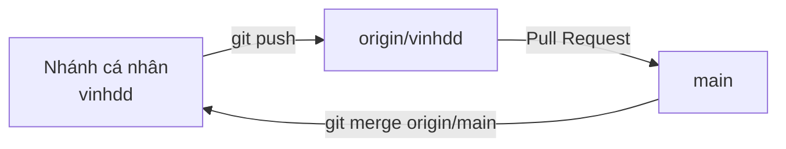

- Repo: `https://github.com/SUMMER2026SE/swp391-rbl-project-group4`
- Làm việc trên nhánh cá nhân (vd `vinhdd`), tạo PR vào `main`, không push trực tiếp lên `main`.
- Cập nhật nhánh: `git fetch origin && git merge origin/main`.
- Quy ước commit: tiền tố `Feat:` / `Fix:` / `Chore:` / `Docs:` / `Refactor:` / `Revert:`.
- File bị `.gitignore`: `node_modules/`, `*.env` (trừ `.env.example`), `dist/`, `.claude/`.

---

## 9. PHỤ LỤC

### 9.1. Toàn bộ 24 nhóm route (389 endpoint)

| Nhóm route | Endpoint | Mount tại |
|---|:---:|---|
| `admin` | 158 | `/api/admin` |
| `teacher` | 97 | `/api/teacher` |
| `flashcards` | 19 | `/api/flashcards` |
| `courses` | 13 | `/api/courses` |
| `listening` | 12 | `/api/listening` |
| `subscription` | 11 | `/api/subscription` |
| `studyLists` | 11 | `/api/study-lists` |
| `mockExams` | 10 | `/api/mock-exams` |
| `ai` | 9 | `/api/ai` |
| `auth` | 7 | `/api/auth` |
| `quizzes` | 7 | `/api/quizzes` |
| `users` | 5 | `/api/users` |
| `lessons` | 4 | `/api/lessons` |
| `learningPath` | 4 | `/api/learning-path` |
| `kanji` | 3 | `/api/kanji` |
| `reading` | 3 | `/api/reading` |
| `writing` | 3 | `/api/writing` |
| `dictionary` | 2 | `/api/dictionary` |
| `grammar` | 2 | `/api/grammar` |
| `grammarPoints` | 2 | `/api/grammar-points` |
| `vocabulary` | 2 | `/api/vocabulary` |
| `teacherApplications` | 2 | `/api/teacher-applications` |
| `webhooks` | 2 | `/api/webhooks` |
| `paymentQr` | 1 | `/api/paymentQr` |

### 9.2. Bản đồ 100 route frontend

| Nhóm | Route tiêu biểu |
|---|---|
| **Public (6)** | `/`, `/login`, `/register`, `/forgot-password`, `/reset-password` |
| **Dùng chung** | `/profile`, `/chat`, `/teacher-application` |
| **Student (36)** | `/dashboard`, `/courses`, `/courses/:id`, `/lessons/:id`, `/lessons/:id/reading`, `/lessons/:lessonId/grammar/:itemId`, `/vocabulary`, `/grammar`, `/kanji`, `/kanji/writing`, `/study-lists/:type/:id[/:itemId]`, `/writing`, `/listening`, `/reading[/:id]`, `/dictionary`, `/quizzes/:id`, `/flashcards` (+ `/new`, `/:id`, `/:id/edit`, `/:id/test`, `/folders/:id`), `/mock-exams` (+ `/:id`, `/history`, `/attempt/:attemptId[/result|/review]`), `/learning-path`, `/pricing`, `/subscription`, `/billing`, `/my-purchases` |
| **Teacher (15)** | `/teacher`, `/teacher/courses[/preview/:id]`, `/teacher/courses/:courseId/edit`, `/teacher/courses/:courseId/units/:unitId/edit`, `/teacher/lessons/:lessonId/{video,reading,vocabulary,kanji,quiz,grammar}`, `/teacher/{vocab,kanji,grammar,study-lists,listening,earnings,dictionary,question-bank}` |
| **Admin (31)** | `/admin`, `/admin/users`, `/admin/courses[/preview/:id]`, `/admin/courses/:courseId/edit`, `/admin/lessons/:lessonId/{...}`, `/admin/{vocabulary,kanji,grammar-points,study-lists}`, `/admin/teacher-applications`, `/admin/system`, `/admin/questions`, `/admin/mock-exams[/:id]`, `/admin/jlpt-bank`, `/admin/revenue-pool`, `/admin/{reading,listening,placement,subscriptions,payments}` |
| **Fallback** | `*` → trang 404 |

### 9.3. Biến môi trường backend

| Nhóm | Biến |
|---|---|
| Supabase | `SUPABASE_URL`, `SUPABASE_ANON_KEY`, `SUPABASE_SERVICE_ROLE_KEY`, `SUPABASE_DB_URL` (chỉ script seed) |
| Server | `NODE_ENV`, `API_PORT`, `FRONTEND_URL` |
| AI | `FPT_AI_API_KEY`, `FPT_AI_MODEL`, `FPT_AI_WHISPER_MODEL`, `FPT_AI_JLPT_MODEL` |
| Email | `SMTP_HOST`, `SMTP_PORT`, `SMTP_USER`, `SMTP_PASS`, `SMTP_FROM` |
| Thanh toán | `SEPAY_API_TOKEN`, `SEPAY_WEBHOOK_KEY`, `PAYMENT_PROVIDER`, `QR_PROVIDER`, `QR_BANK_CODE`, `QR_ACCOUNT_NUMBER`, `PAYMENT_ORDER_EXPIRE_MINUTES`, `SUBSCRIPTION_DURATION_DAYS`, `TRANSFER_CONTENT_PREFIX`, `COURSE_TRANSFER_CONTENT_PREFIX` |

### 9.4. Tổng hợp giới hạn & rủi ro đã biết

| Vấn đề | Chi tiết | Vị trí |
|---|---|---|
| Không có RLS | Phân quyền hoàn toàn ở tầng controller; sót một chỗ là lỗ hổng IDOR | toàn bộ controller |
| Quota fail-open | Quota service lỗi → cho request đi qua, hạn mức không được thực thi | `middleware/checkQuota.js` |
| examGuard không phủ quiz | Chỉ chặn AI khi thi thử; quiz chỉ ghi DB lúc nộp nên không chặn được | `services/examGuard.js` |
| Whisper không có timestamp | FPT Whisper chỉ trả `{text, usage}` → buộc dùng VAD để chia câu | `config/audio.js`, `services/lessonTranscribe.js` |
| `updateUserById` ghi đè metadata | Phải dùng `updateUserMetadata()` để merge, nếu không mất `full_name`/`avatar_url` | `config/supabase.js` |
| yt-dlp không có trên PATH | pip cài module chứ không tạo binary → cần fallback `python -m yt_dlp` | `config/youtube.js` |
| Bẫy `PORT` vs `API_PORT` | `.env` có `PORT=3000`; phải ưu tiên `API_PORT=3001` cho khớp Vite proxy | `backend/server.js` |
| Cần Node 22 | `supabase-js` v2.106+ yêu cầu native WebSocket | `backend/package.json` |

---

*Tài liệu được tổng hợp từ khảo sát trực tiếp source code và database của dự án.*
