# Thiết kế Cơ sở dữ liệu — Kizuna Nihongo

> Tài liệu thiết kế database cho nền tảng học tiếng Nhật Kizuna Nihongo (Sorakara).
> Database: **PostgreSQL 17 (Supabase)** — 96 bảng, tổ chức thành **10 schema nghiệp vụ** theo domain + schema `public` chỉ chứa thành phần hệ thống.
> Áp dụng từ migration `029_reorganize_schemas.sql` + `030_drop_dead_tables.sql`.

---

## 1. Nguyên tắc thiết kế

Database được phân chia theo mô hình **schema-per-domain** (mỗi schema là một bounded context nghiệp vụ độc lập):

1. **Mỗi schema = một domain nghiệp vụ** — mọi bảng phục vụ cùng một nhóm chức năng nằm chung một schema, đặt tên theo hậu tố `_module`.
2. **Tách riêng dữ liệu tài chính** — toàn bộ bảng liên quan tiền (gói premium, thanh toán, hạn mức, chia doanh thu giáo viên) gom về `billing_module`; chỉ role `service_role` (backend) được truy cập, thuận tiện audit và siết bảo mật.
3. **`public` chỉ chứa hệ thống** — bảng `session` (session store của app EJS), `app_settings` (cấu hình key-value), các hàm RPC và compat view; không chứa bảng nghiệp vụ.
4. **Phân quyền 2 lớp** — Row Level Security (RLS) bật trên toàn bộ bảng; backend truy cập qua `service_role` (bypass RLS), client không truy vấn DB trực tiếp. Vai trò người dùng (`student`/`teacher`/`admin`) lưu trong `user_metadata` của Supabase Auth.
5. **FK cross-schema cho quan hệ liên domain** — ví dụ `billing_module.payments.course_id → course_module.courses.id`; join liên schema thực hiện ở tầng backend.

## 2. Sơ đồ tổng quan các domain

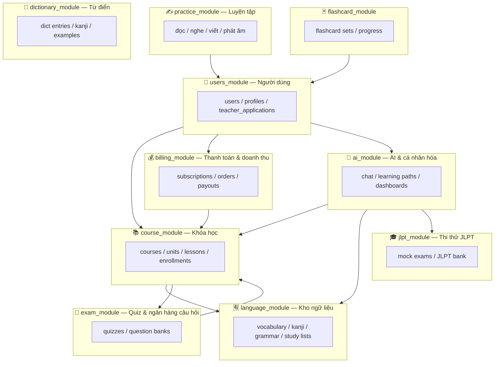

## 3. Danh sách schema và bảng

| # | Schema | Số bảng | Domain |
|---|--------|---------|--------|
| 1 | `users_module` | 6 | Hồ sơ người dùng, vai trò, đơn đăng ký giáo viên |
| 2 | `course_module` | 11 | Khóa học → Bài học (units) → Mục (lessons), ghi danh, tiến độ, đánh giá |
| 3 | `language_module` | 17 | Kho từ vựng / kanji / ngữ pháp chuẩn + bài đăng danh sách học tập |
| 4 | `practice_module` | 12 | Luyện đọc, luyện nghe, luyện viết, luyện phát âm |
| 5 | `flashcard_module` | 6 | Thẻ ghi nhớ (học phần, thư mục, tiến độ, bài kiểm tra AI) |
| 6 | `exam_module` | 9 | Quiz trong khóa học + ngân hàng câu hỏi (admin & giáo viên) |
| 7 | `jlpt_module` | 8 | Thi thử JLPT (mock exams) + ngân hàng đề JLPT |
| 8 | `dictionary_module` | 5 | Từ điển Nhật–Việt (dữ liệu import ~17k mục từ) |
| 9 | `billing_module` | 11 | Gói premium, thanh toán SePay, hạn mức tính năng, chia doanh thu giáo viên |
| 10 | `ai_module` | 9 | Chat AI Sensei, lộ trình học cá nhân hóa, dashboard, thông báo |
| — | `public` | 2 + views | Hệ thống: `session`, `app_settings`, hàm RPC, compat views |

---

## 4. Chi tiết từng schema

### 4.1. `users_module` — Người dùng & định danh

Nguồn định danh gốc là `auth.users` (Supabase Auth). Khi user đăng ký, trigger `handle_new_user` (SECURITY DEFINER) tự động tạo bản ghi tương ứng trong `users`, `student_profiles` và `ai_module.student_dashboards` — không bao giờ insert thủ công vào các bảng này.

| Bảng | Mô tả |
|------|-------|
| `users` | Hồ sơ user (mirror `auth.users`): họ tên, email, avatar |
| `student_profiles` | Trình độ JLPT hiện tại/mục tiêu, mục tiêu học, thời gian học/ngày |
| `teacher_profiles` | Hồ sơ giáo viên |
| `teacher_applications` | Đơn đăng ký làm giáo viên: tài liệu (CV/bằng cấp), AI review (`ai_verdict`, `ai_confidence`) + admin duyệt |
| `roles` | Danh mục vai trò |
| `user_audit_logs` | Nhật ký hoạt động |

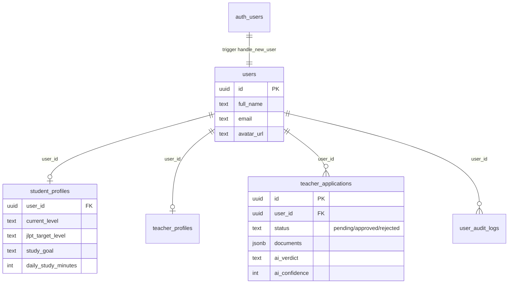

### 4.2. `course_module` — Khóa học

Cấu trúc 3 tầng: **Khóa học (courses) → Bài học (units) → Mục (lessons)**. Mục có nhiều loại nội dung (`content_type`: reading / video / grammar / vocabulary / kanji / quiz). Khóa học có thể miễn phí hoặc trả phí (`is_free`, `price`, `commission_rate`), do admin hoặc giáo viên tạo (`creator_type`).

| Bảng | Mô tả |
|------|-------|
| `courses` | Khóa học; cache `enrollment_count`, `avg_rating` qua trigger |
| `units` | Bài học — tầng giữa của khóa |
| `lessons` | Mục — đơn vị nội dung nhỏ nhất; có `transcript_segments` (video), liên kết bài đọc |
| `course_enrollments` | Ghi danh (tự tạo bởi trigger khi thanh toán hoàn tất) |
| `lesson_progress` | Tiến độ hoàn thành từng Mục của học viên |
| `course_reviews` | Đánh giá 1–5 sao, UNIQUE(course, student); trigger cập nhật `avg_rating` |
| `lesson_vocabulary` / `lesson_kanji` / `lesson_grammar` / `lesson_grammar_points` | Bảng nối Mục ↔ ngữ liệu trong `language_module` |
| `skills` | Danh mục kỹ năng |

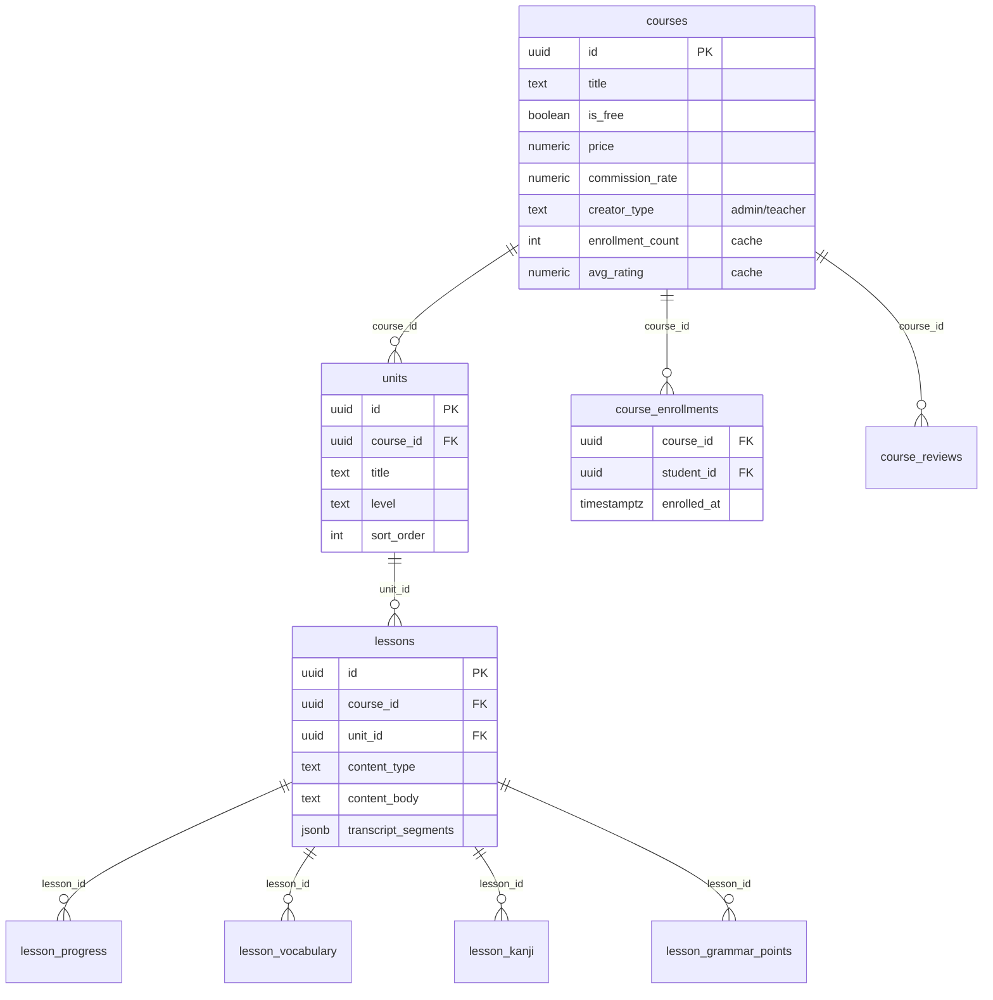

### 4.3. `language_module` — Kho ngữ liệu tiếng Nhật

Kho học liệu chuẩn (từ vựng, kanji, mẫu ngữ pháp, điểm ngữ pháp) dùng chung toàn hệ thống + **bài đăng danh sách học tập** (study lists) do admin/giáo viên biên soạn. Bài đăng của giáo viên chỉ dành cho học viên Premium.

| Bảng | Mô tả |
|------|-------|
| `vocabulary` / `kanji` | Kho từ vựng (429), kanji (2.229) chuẩn theo cấp JLPT |
| `grammar_points` | Từ điển điểm ngữ pháp (528) — item của study list loại grammar |
| `grammar_patterns` | Mẫu ngữ pháp theo bài |
| `jlpt_levels` | Bảng tra cấp độ N5–N1 |
| `topics` / `vocabulary_topics` | Chủ đề từ vựng |
| `vocabulary_sets` / `vocabulary_set_items`, `kanji_sets` / `kanji_set_items`, `grammar_sets` / `grammar_set_items` | Bộ sưu tập ngữ liệu |
| `study_list_posts` / `study_list_items` | Bài đăng danh sách (vocabulary/kanji/grammar); `item_id` đa hình trỏ tới 1 trong 3 kho |
| `teacher_vocabulary` / `teacher_kanji` | Bản nháp giáo viên gửi chờ admin duyệt |

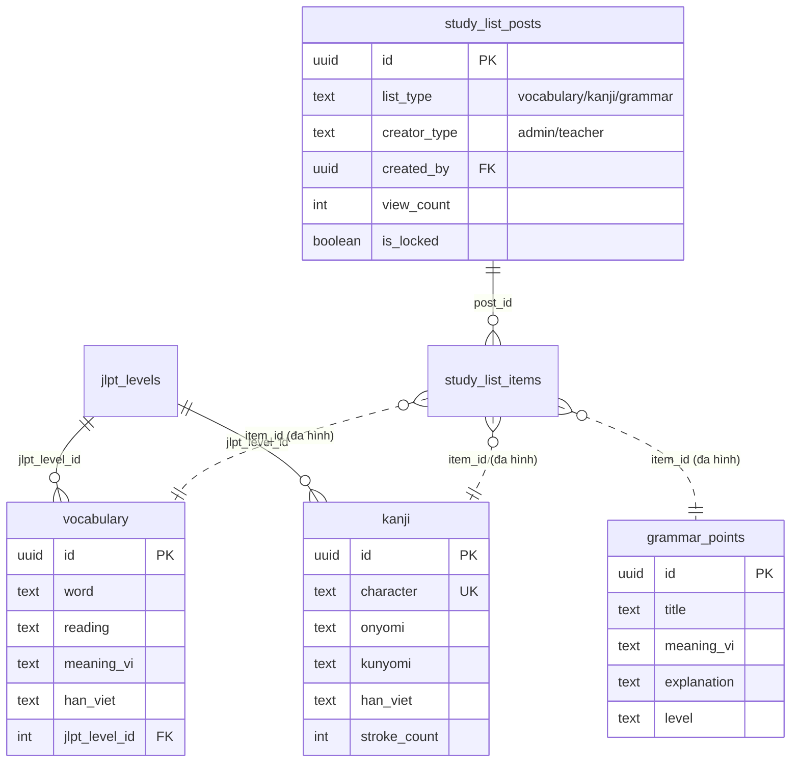

### 4.4. `practice_module` — Luyện tập 4 kỹ năng

Gom toàn bộ tính năng luyện **đọc – nghe – viết – phát âm** về một domain.

| Nhóm | Bảng | Mô tả |
|------|------|-------|
| Đọc | `articles` / `article_reads` | Bài luyện đọc sinh bằng AI (`segments`, `questions`, `vocab`, `grammar` dạng jsonb); dedupe lượt đọc + quota |
| Đọc (bộ đề) | `reading_sets` / `rs_passages` / `rs_questions` / `rs_options` / `rs_drafts` | Bộ đề đọc JLPT có cấu trúc: đoạn văn → câu hỏi → lựa chọn; draft autosave |
| Nghe | `listening_dialogues` / `listening_dialogue_lines` | Hội thoại luyện nghe theo kịch bản |
| Nghe | `listening_user_audios` | Bài nghe do user/admin tạo (TTS / audio / video / YouTube) |
| Viết | `writing_submissions` | Bài viết nộp chấm |
| Nói | `pronunciation_assessments` | Đánh giá phát âm |

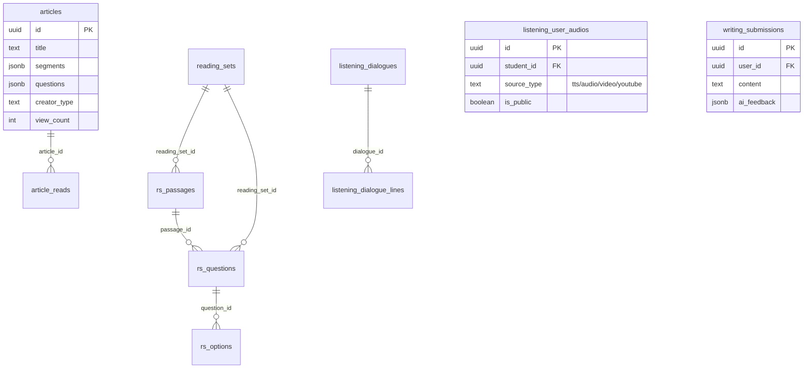

### 4.5. `flashcard_module` — Thẻ ghi nhớ

| Bảng | Mô tả |
|------|-------|
| `flashcard_folders` / `flashcard_sets` / `flashcard_folder_sets` | Thư mục ↔ học phần (N-N) |
| `flashcards` | Thẻ (term / definition) |
| `flashcard_progress` | Tiến độ (learning / mastered), PK (student, card) |
| `flashcard_tests` | Bài kiểm tra AI sinh — mỗi set 1 bài (`set_id` UNIQUE) |

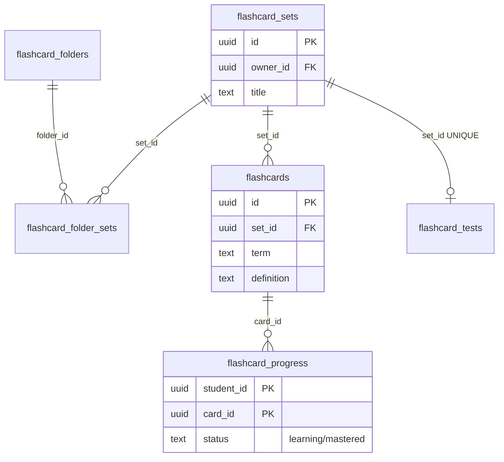

### 4.6. `exam_module` — Quiz & ngân hàng câu hỏi

Quiz gắn với khóa học/Mục, có chế độ thi nghiêm túc (proctored: fullscreen bắt buộc, khóa thi 20 phút khi vi phạm). Ngân hàng câu hỏi riêng cho admin và giáo viên, hỗ trợ sinh câu hỏi bằng AI.

| Bảng | Mô tả |
|------|-------|
| `quizzes` | Quiz/đề thi: `is_exam`, `mode`, `strict_fullscreen`, `passing_type/value` |
| `quiz_questions` | Câu hỏi; `passage_snapshot` (jsonb) đóng băng đoạn văn tại thời điểm gắn |
| `quiz_attempts` | Bài làm; `ai_feedback` (chấm AI câu tự luận), `passed` |
| `quiz_lockouts` | Đếm vi phạm thoát fullscreen → khóa thi; UNIQUE(quiz, user) |
| `question_bank` / `teacher_question_bank` | Ngân hàng câu hỏi của admin / giáo viên |
| `reading_passages` / `listening_passages` / `teacher_reading_passages` | Đoạn văn & bài nghe nguồn cho câu hỏi |

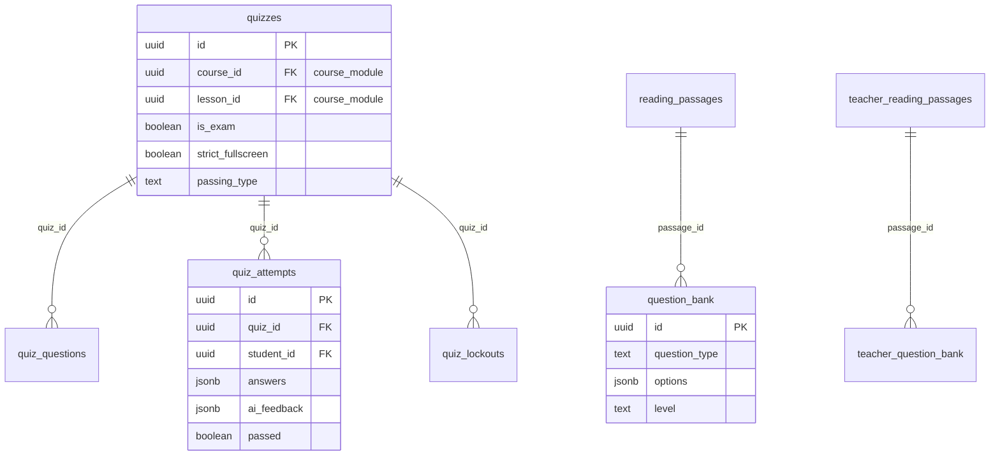

### 4.7. `jlpt_module` — Thi thử JLPT

Mô phỏng cấu trúc đề JLPT thật: đề → phần thi (timer riêng) → nhóm mondai (chung passage/audio) → câu hỏi. Có bảng xếp hạng theo lần thi và ngân hàng đề tái sử dụng.

| Bảng | Mô tả |
|------|-------|
| `mock_exams` | Đề thi thử theo cấp N5–N1; `is_free` |
| `mock_exam_sections` | Phần thi (kiến thức ngôn ngữ / đọc / nghe) với timer riêng |
| `mock_question_groups` | Nhóm mondai (21 loại `mondai_type`), passage/audio chung |
| `mock_questions` | Câu hỏi: `options` (jsonb), `correct_index`, bản dịch, transcript |
| `mock_attempts` / `mock_attempt_answers` | Lần thi (`scores` jsonb, deadline theo phần) + đáp án từng câu |
| `jlpt_bank_groups` / `jlpt_bank_questions` | Ngân hàng nhóm passage & câu hỏi (nguồn: manual/AI/import) |

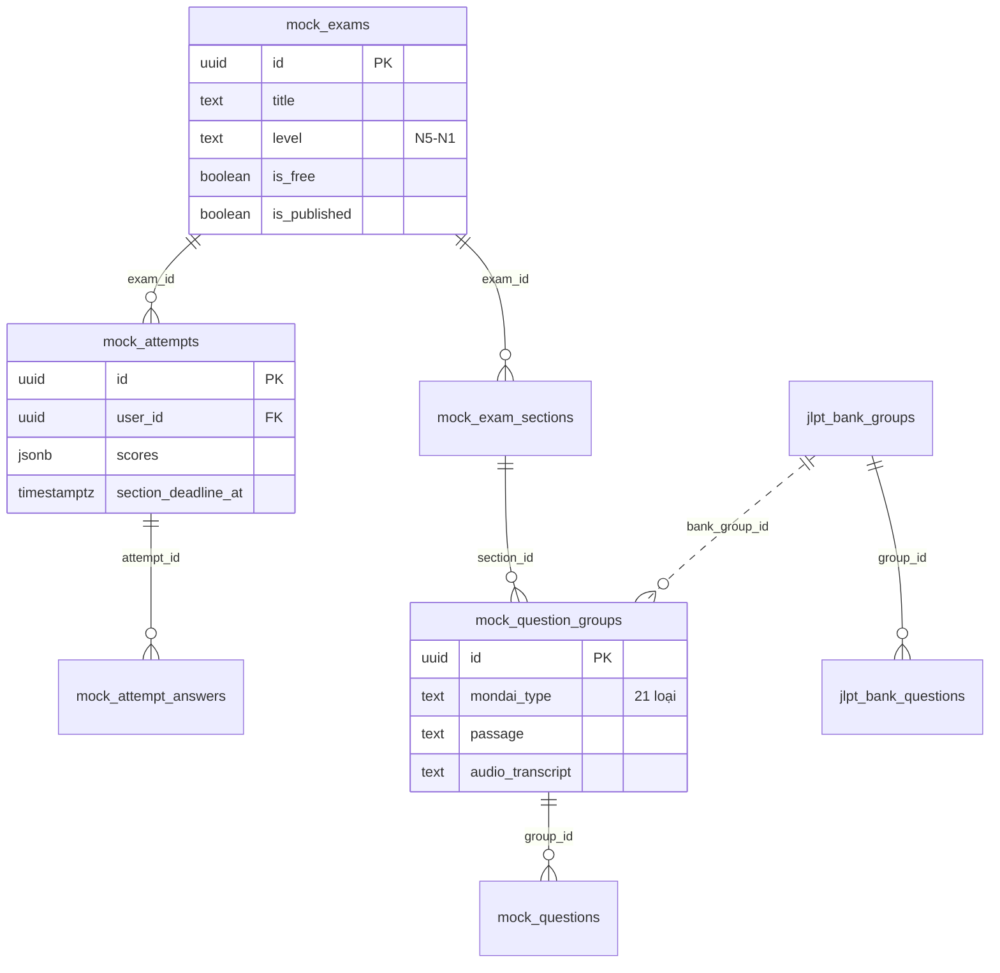

### 4.8. `dictionary_module` — Từ điển Nhật–Việt

Dữ liệu từ điển import quy mô lớn (~17k mục từ, ~28k nghĩa, ~10k kanji, ~10k câu ví dụ). Tra cứu theo nghĩa tiếng Việt qua hàm RPC `search_dict_by_meaning` (unaccent + ranking).

| Bảng | Mô tả |
|------|-------|
| `dict_entries` | Mục từ; UNIQUE(source, source_id) |
| `dict_senses` | Nghĩa của mục từ |
| `dict_examples` | Câu ví dụ kèm furigana |
| `dict_kanji` | Kanji từ điển (`sino_vi` — âm Hán Việt) |
| `dict_related_words` | Từ liên quan / đồng nghĩa / trái nghĩa (self-reference) |

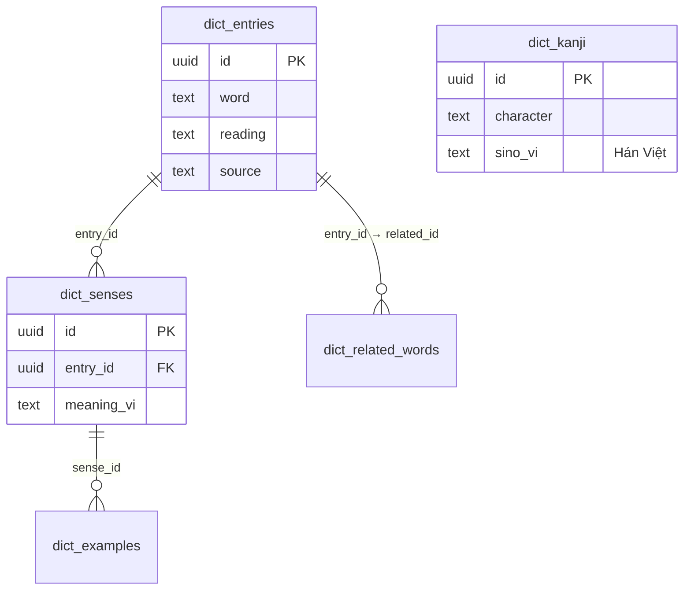

### 4.9. `billing_module` — Thanh toán & doanh thu

**Toàn bộ dữ liệu liên quan tiền nằm trong một schema duy nhất**, chỉ `service_role` (backend) có quyền truy cập. Hai luồng thanh toán qua SePay (phân biệt bằng prefix mã chuyển khoản): `PREM…` → gói premium, `COURSE…` → mua khóa học. Webhook/polling khớp giao dịch ngân hàng với order đang chờ (idempotent, optimistic lock).

| Nhóm | Bảng | Mô tả |
|------|------|-------|
| Premium | `subscription_plans` | Gói (free / premium_monthly) |
| Premium | `user_subscriptions` | Trạng thái premium của user (active / grace_period / cancelled) |
| Thanh toán | `payment_orders` | Order premium: `payment_code` (PREM…), QR, hết hạn 30 phút |
| Thanh toán | `course_payment_orders` | Order mua khóa học (COURSE…) |
| Thanh toán | `payment_transactions` | Giao dịch SePay thô, khớp với order |
| Thanh toán | `payments` | Bản ghi mua khóa hoàn tất: `platform_fee`, `teacher_payout`; trigger tự tạo enrollment |
| Hạn mức | `feature_entitlements` / `feature_usage_counters` | Quota tính năng theo tier (daily/monthly) + bộ đếm sử dụng |
| Doanh thu GV | `content_usage_events` | Log học viên dùng nội dung giáo viên (dedupe theo ngày) |
| Doanh thu GV | `revenue_pool_periods` / `teacher_payouts` | Quỹ % doanh thu premium theo tháng, chia theo tỷ lệ lượt sử dụng |

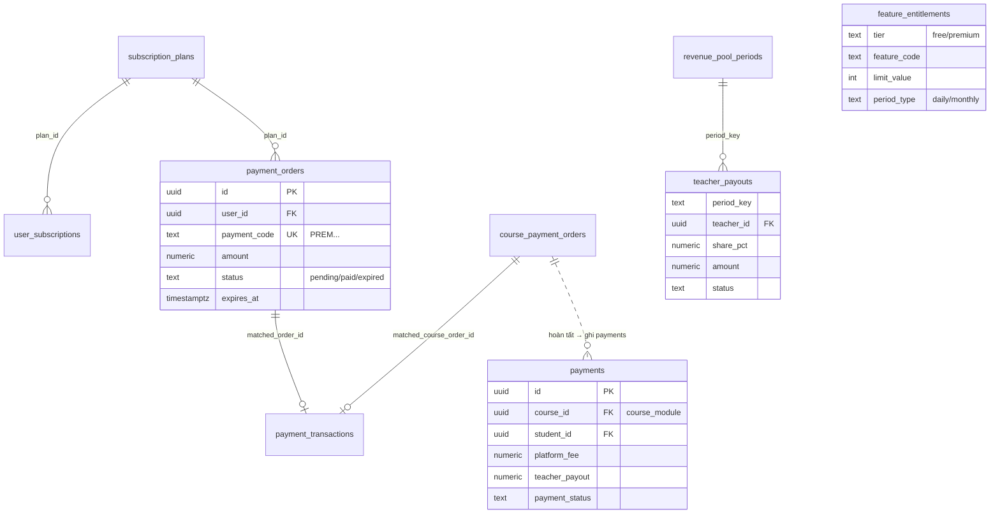

### 4.10. `ai_module` — AI & cá nhân hóa

Các tính năng dùng FPT AI Factory (API tương thích OpenAI): chat AI Sensei, lộ trình học cá nhân hóa, dashboard thống kê.

| Bảng | Mô tả |
|------|-------|
| `chat_sessions` / `chat_messages` | Lịch sử hội thoại AI Sensei |
| `learning_paths` / `learning_path_steps` | Lộ trình học AI sinh: mốc theo thứ tự, `resource_type` đa hình (course / study_list / mock_exam); 1 path active/user |
| `student_dashboards` | Thống kê học tập (streak, `skill_scores` jsonb) — tạo bởi trigger `handle_new_user` |
| `notifications` | Thông báo |
| `ai_generated_questions` / `ai_learning_paths` / `kanji_writing_sheets` | Dữ liệu AI sinh khác |

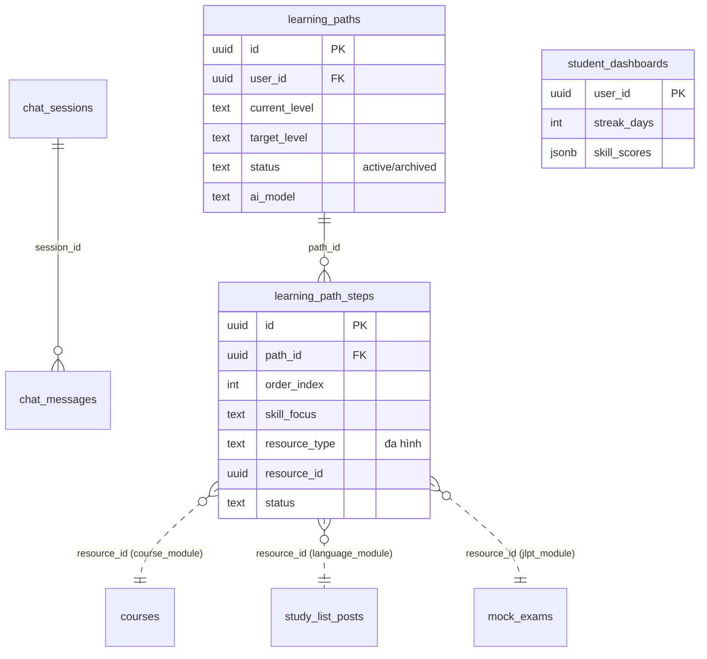

---

## 5. Quan hệ liên schema (cross-schema)

Các FK/quan hệ quan trọng nối giữa những domain:

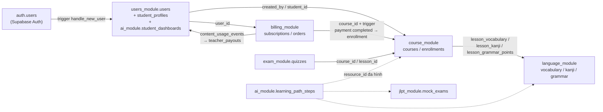

- **Thanh toán → ghi danh:** khi `billing_module.payments` có bản ghi `completed`, trigger `trg_payments_enroll` tự insert `course_module.course_enrollments` (idempotent).
- **Chia doanh thu giáo viên:** cron hàng tháng gọi RPC `vip_revenue()` (tổng doanh thu premium) và `teacher_uses()` (lượt dùng nội dung mỗi giáo viên) → chia quỹ theo tỷ lệ vào `teacher_payouts`.
- **Quan hệ đa hình** (không có FK cứng, validate ở backend): `study_list_items.item_id`, `learning_path_steps.resource_id`.

## 6. Bảo mật & hạ tầng

| Thành phần | Thiết kế |
|------------|----------|
| **Auth** | Supabase Auth (JWT, PKCE flow ở frontend). Vai trò lưu trong `user_metadata`, kiểm tra ở middleware backend (`requireAuth` / `requireTeacher` / `requireAdmin`) |
| **RLS** | Bật trên 100% bảng nghiệp vụ. Backend dùng `service_role` (bypass RLS); client không truy vấn DB trực tiếp |
| **billing_module** | Chỉ GRANT cho `service_role` — anon/authenticated không thấy dữ liệu tài chính kể cả khi có key |
| **Exposed schemas (PostgREST)** | `public, graphql_public, course_module, language_module, users_module, ai_module, practice_module, billing_module, dictionary_module, flashcard_module, exam_module, jlpt_module` |
| **Compat views** | `public.users`, `public.courses`, `public.lessons`, `public.vocabulary`, `public.kanji`, `public.student_profiles`… là view tương thích trỏ vào bảng gốc trong module schema (kèm INSTEAD OF trigger cho insert/update) — giữ ổn định cho code cũ, sẽ loại bỏ dần |
| **Hàm RPC (public)** | `vip_revenue()`, `teacher_uses()` (doanh thu), `search_dict_by_meaning()` (tra từ điển), `f_unaccent()` (index tiếng Việt) |
| **Trigger chính** | `handle_new_user` (tạo hồ sơ khi signup), `trg_payments_enroll` (thanh toán → ghi danh), `trg_recalc_course_rating` / `trg_recalc_enrollment_count` (cache số liệu khóa học) |

## 7. Ghi chú lịch sử

- Migration `029_reorganize_schemas.sql` (07/2026): đổi tên `content_module → course_module`, `vocabulary_module → language_module`; tạo mới `practice_module`, `billing_module`; di chuyển 33 bảng từ `public` và các schema cũ về đúng domain; `public` từ 29 bảng nghiệp vụ giảm còn 2 bảng hệ thống.
- Migration `030_drop_dead_tables.sql`: xóa 10 bảng chết (0 dòng) của mô hình exam cũ + 2 schema rỗng (`reading_module`, `materials_module`).
- Migration `031_drop_listening_module.sql`: xóa schema `listening_module` — bản sao cũ bị bỏ rơi của tính năng luyện nghe (dữ liệu snapshot đóng băng, trùng UUID với bảng đang dùng ở `practice_module`).
- `database/schema.sql` và `database/migrate.sql` ở root là tài liệu bootstrap lịch sử, **không phản ánh cấu trúc hiện tại** — nguồn chuẩn là Supabase + chuỗi migration trong `backend/migrations/`.
